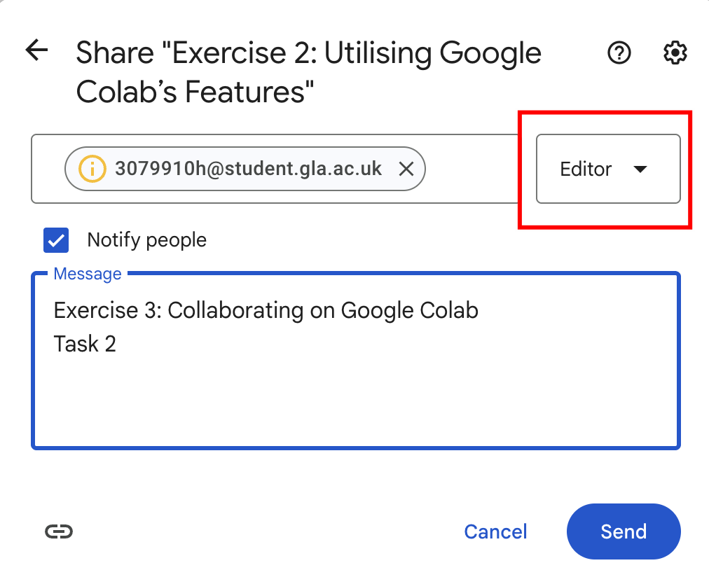
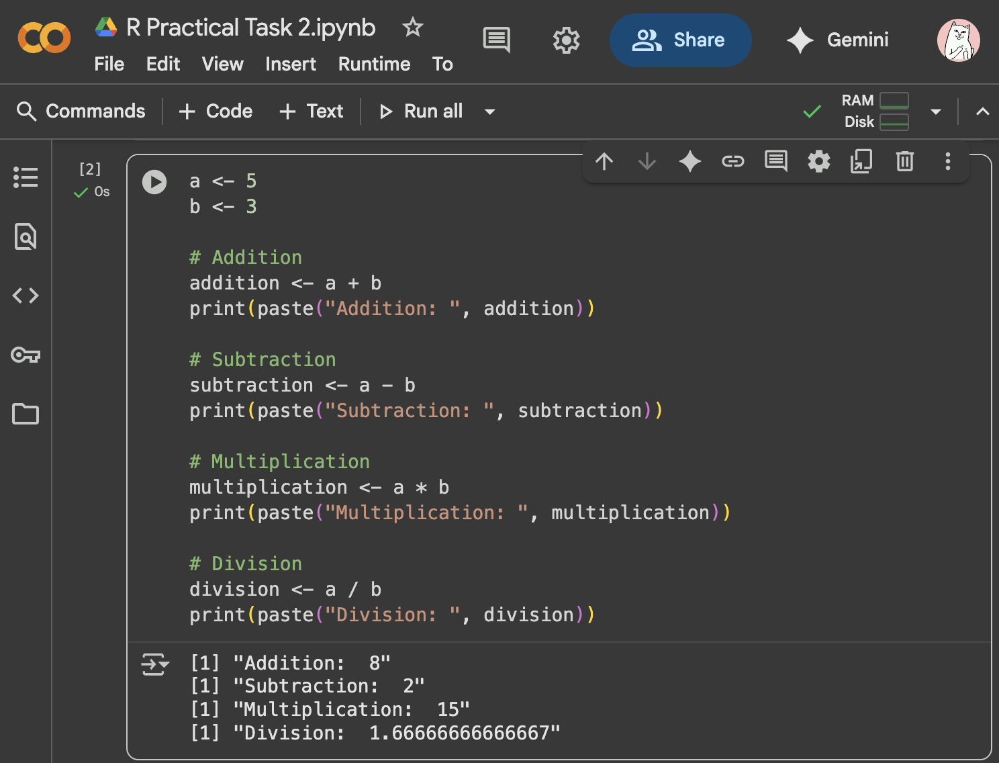

<h1 align="center">
Google Colab - Step-by-step practical exercises File
</h1>


# 1. Google Colab

## Exercise 1: Getting Started with Google Colab

1. Task:Open Google Colab by visiting colab.research.google.com.
2. Task:Create a new notebook titled "Introduction tGoogle Colab."
3. Task:Write a Python script in a code cell that prints "Hello, Colab!" and run the cell
4. Task:Add a markdown cell that explains what the notebook is about.

 

## Exercise 2: Utilising Google Colab’s Features

1. Task:Enable GPU support for your notebook


2. Task:Write a Python script that generates a random array using NumPy and multiplies it by 10


3. Task: Install the matplotlib library and create a simple plot.


## Exercise 3: Collaborating on Google Colab

1. Task:Share your notebook with a classmate or colleague via Google Drive.

oInstructions:Click "Share" in the top-right corner of the notebook and enter their email address.


2. Task:Collaborate on the same notebook by having both of you edit different cells simultaneously.



3. Task:Use the "Revision History" feature tview and revert changes.


## Exercise 4: Advanced Google Colab Usage

1. Task: Connect your Google Drive tthe notebook and list all files in a specific folder.


2. Task: Create a new file in your Google Drive from Colab and write some text tit.


```python
file_path = "/content/drive/MyDrive/Colab Notebooks/HOLLK Exercise 4 Task 2.ipynb"
with open(file_path, 'w') as f:
  f.write('this is a test message from Exercise 4: Advanced Google Colab Usage.ipynb')
```


# 2. How tuse R with Google Colab

## Practical Task 1: Setting Up R in Google Colab

### Task 1.1: Create a New Colab Notebook

Open Google Colab.

Sign in with your Google account.

Create a new notebook by clicking on "New Notebook."


### Task 1.2: Set Up R Kernel in Google Colab

* Instructions:
  * Google Colab uses the IPython kernel by default. Trun R code, you'll need tinstall the R kernel using the following commands.
  * Create a new code cell and run the following code tinstall R and essential R packages:

```python
# Install R and necessary packages
!apt-get install -y r-base
!R -e "install.packages('IRkernel'); IRkernel::installspec(user = FALSE)"
```

* Explanation:This installs the base R language and the IRkernel, which allows you trun R code in Colab.


### Task 1.3: Switch tR Kernel

* Instructions:
  * After installing the R kernel, switch tit by selecting "Runtime" > "Change runtime type."
  * Under "Runtime type," select "R" from the "Runtime" dropdown menu and click "Save."


## Practical Task 2: Writing and Running R Code in Google Colab

### Task 2.1: Write and Execute Simple R Code

* Instructions:
  * In your notebook, write a simple R script that prints "Hello, R in Colab!".
  * Create a new code cell and enter the following R code:

```R
print("Hello, R in Colab!")
```

* Task: Run the cell by clicking the "Run" button or pressing Shift + Enter.


### Task 2.2: Perform Basic Mathematical Operations in R

* Instructions:
  * Create a new code cell and write R code tperform basic arithmetic operations.
  * Use the following R code:

```R
a <- 5
b <- 3

# Addition
addition <- a + b
print(paste("Addition: ", addition))

# Subtraction
subtraction <- a - b
print(paste("Subtraction: ", subtraction))

# Multiplication
multiplication <- a * b
print(paste("Multiplication: ", multiplication))

# Division
division <- a / b
print(paste("Division: ", division))
```

* Task: Run the cell and observe the output.



## Practical Task 3: Working with Data in R

### Task 3.1: Load and Inspect a Dataset in R

* Instructions:
  * Use R's built-in `mtcars` dataset for analysis.
  * Create a new code cell and write the following R code tload and inspect the dataset:

```R
# Load the mtcars dataset
data("mtcars")

# Display the first few rows of the dataset
head(mtcars)
```

* Task: Run the cell and inspect the output.


### Task 3.2: Perform Basic Data Manipulation

* Instructions:
  * Create a new code cell tperform data manipulation on the `mtcars` dataset.
  * Use the following R code tcalculate the mean miles per gallon (mpg) for cars with more than 6 cylinders:

```R
# Filter the dataset for cars with more than 6 cylinders
cars_over_6_cyl <- subset(mtcars, cyl > 6)

# Calculate the mean mpg for these cars
mean_mpg <- mean(cars_over_6_cyl$mpg)
print(paste("Mean MPG for cars with more than 6 cylinders: ", mean_mpg))
```

* Task: Run the cell and observe the output.


## Practical Task 4: Visualizing Data in R

### Task 4.1: Create a Basic Plot

* Instructions:
  * Create a new code cell tgenerate a basic scatter plot using the `plot()` function in R.
  * Use the following R code:

```R
# Scatter plot of horsepower (hp) vs. miles per gallon (mpg)
plot(mtcars$hp, mtcars$mpg,
   main = "Scatter plot of HP vs MPG",
   xlab = "Horsepower",
   ylab = "Miles Per Gallon",
   pch = 19, col = "blue")
```

* Task: Run the cell tgenerate the plot.


### Task 4.2: Create a More Advanced Plot Using ggplot2

* Instructions:
  * Install the `ggplot2` package and create a more advanced plot.
  * Create a new code cell and run the following R code:

```R
# Install ggplot2 package
install.packages("ggplot2")
library(ggplot2)

# Create a ggplot
ggplot(mtcars, aes(x = hp, y = mpg)) +
 geom_point(color = "blue", size = 3) +
 geom_smooth(method = "lm", col = "red") +
 labs(title = "HP vs MPG with Linear Regression Line",
		x = "Horsepower",
		y = "Miles Per Gallon")
```

* Task: Run the cell tgenerate the advanced plot.


## Practical Task 5: Saving and Sharing Your R Work

### Task 5.1: Save Your Notebook tGoogle Drive

* Instructions:

  * Ensure your notebook is saved in Google Drive by clicking "File" > "Save" or "Save a copy in Drive."
  * Verify that the notebook is accessible from your Google Drive.

  

### Task 5.2: Export Your Notebook as a PDF

* Instructions:
  * To share your notebook with others, export it as a PDF by clicking "File" > "Print" and selecting "Save as PDF."


