<h1 align="center">
Conda Practical Exercises
</h1>
[TOC]
## Exercise 1: Setting Up Conda

Task: Install Miniconda or Anaconda on your system.

Task: Verify the installation

```shell
conda –version
```


Task: Update Conda to the latest version

```shell
conda update conda
```

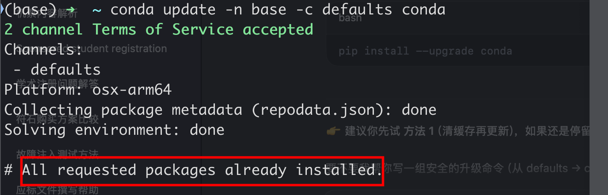


## Exercise 2: Creating and Activating an Environment

Task: Create a new environment named data_science with Python 3.8

```shell
conda create --name data_science python=3.8
```

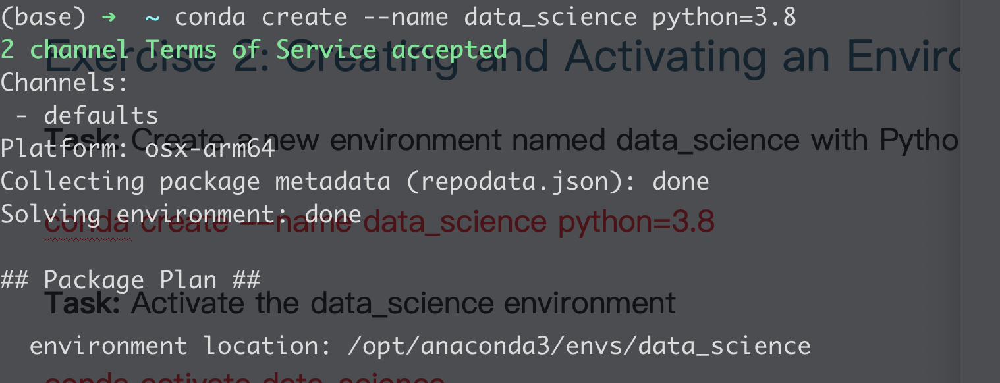

Task: Activate the data_science environment

```shell
conda activate data_science
```

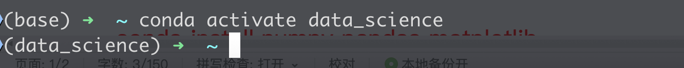

Task: Deactivate the environment.

```shell
conda deactivate
```

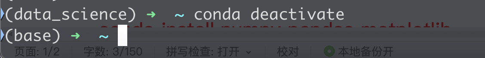

## Exercise 3: Installing and Managing Packages

Task: Install the following packages in your data_science environment: NumPy, Pandas, and Matplotlib.

```shell
conda install numpy pandas matplotlib
```

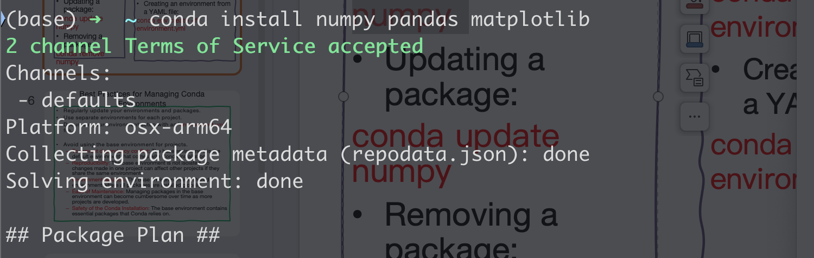

Task: Update the Pandas package to the latest version

```shell
conda update pandas
```

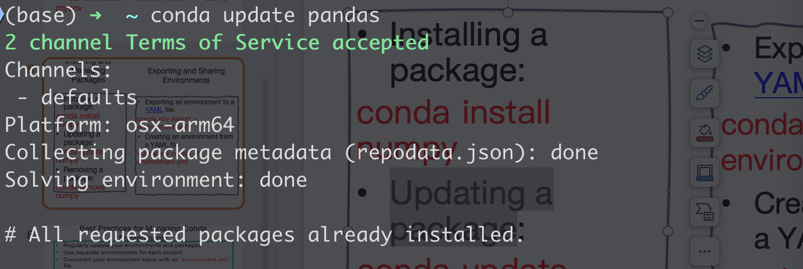

Task: Remove the Matplotlib package

```shell
conda remove matplotlib
```

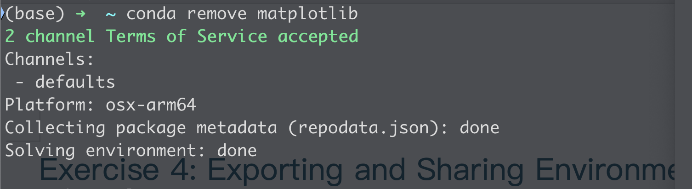

## Exercise 4: Exporting and Sharing Environments

Task: Export your data_science environment to a YAML file named data_science_env.yml.

```shell
conda env export > data_science_env.yml
```

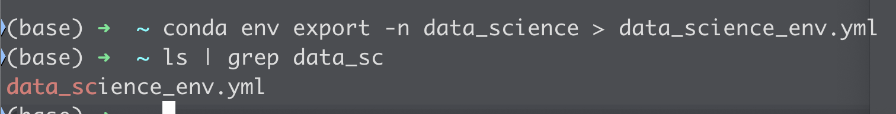

Task: Create a new environment from the exported YAML file

```shell
conda env create -f data_science_env.yml
```

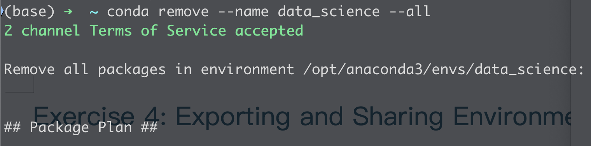

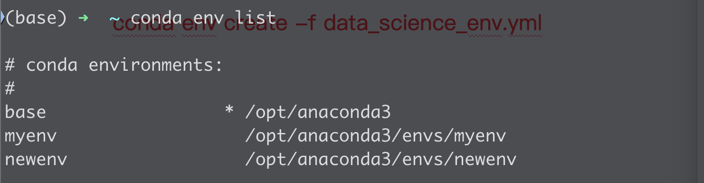

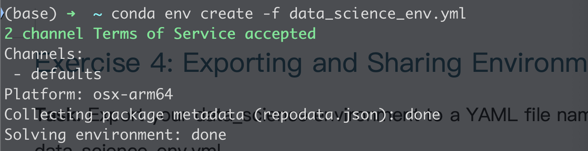

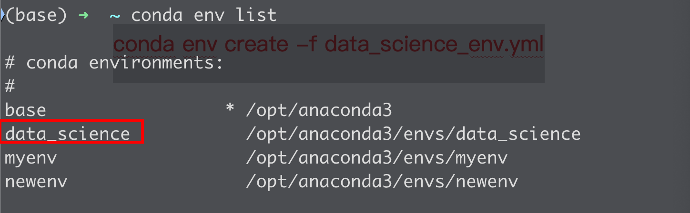

