## Exercise: Day old Bread

A bakery sells loaves of bread for £ 3.49 each. Day old bread is discounted by 60 percent. Write a programme that begins by reading the number of loaves of day old bread being purchased from the user. Then your programme should display the regular price for the bread, the discount because it is a day old, and the total price. Each of these amounts should be displayed on its own line with an appropriate label. All of the values should be displayed using two decimal places, and the decimal points in all the numbers should be aligned when reasonable values are entered by the user.

```python
REGULAR_PRICE = 3.49
DISCOUNT_RATE = 0.60

while True:
    s = input("Enter the number of day-old loaves (positive integer): ")
    try:
        loaves = int(s)
        if loaves <= 0:
            print("Invalid input: please enter a positive integer greater than 0. Try again.")
            continue
        break
    except ValueError:
        print("Invalid input: only whole numbers (like 1, 2, 3) are allowed. Try again.")


regular_total = loaves * REGULAR_PRICE
discount = regular_total * DISCOUNT_RATE
total_price = regular_total - discount

print(f"{'Regular price:':<18} £{regular_total:8.2f}")
print(f"{'Discount:':<18} £{discount:8.2f}")
print(f"{'Total price:':<18} £{total_price:8.2f}")
```

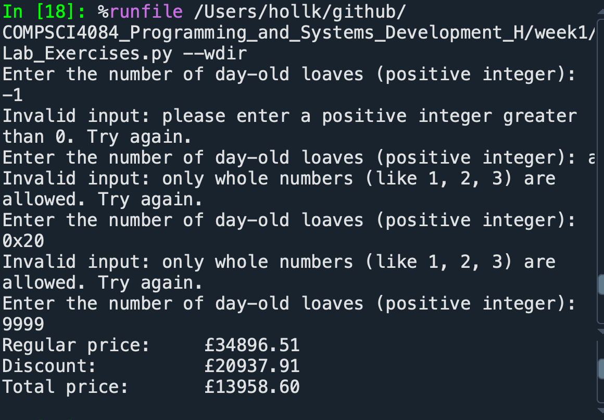

## Exercise: Length and Slicing (23)

Write a programme that asks the user to type in the first line of their favourite song and display the length of that string. The programme should also ask a starting number and an ending number and then display just that section of the text.

```python
song = input("Your favourite song is: ")
length = len(song)
print(f"Your favourite song's length is {length}")

while True:
    try:

        start_num = int(input("the starting number is: "))
        if start_num <= 0 or start_num > length:
            print(f"Start number must be between 1 and {length}. Try again.")
            continue

        end_num = int(input("the ending number is: "))
        if end_num <= 0 or end_num > length:
            print(f"End number must be between 1 and {length}. Try again.")
            continue

        if start_num > end_num:
            print("Start number cannot be greater than end number. Try again.")
            continue

        print(song[start_num-1:end_num])
        break

    except ValueError:
        print("Please enter a valid integer number.")
```

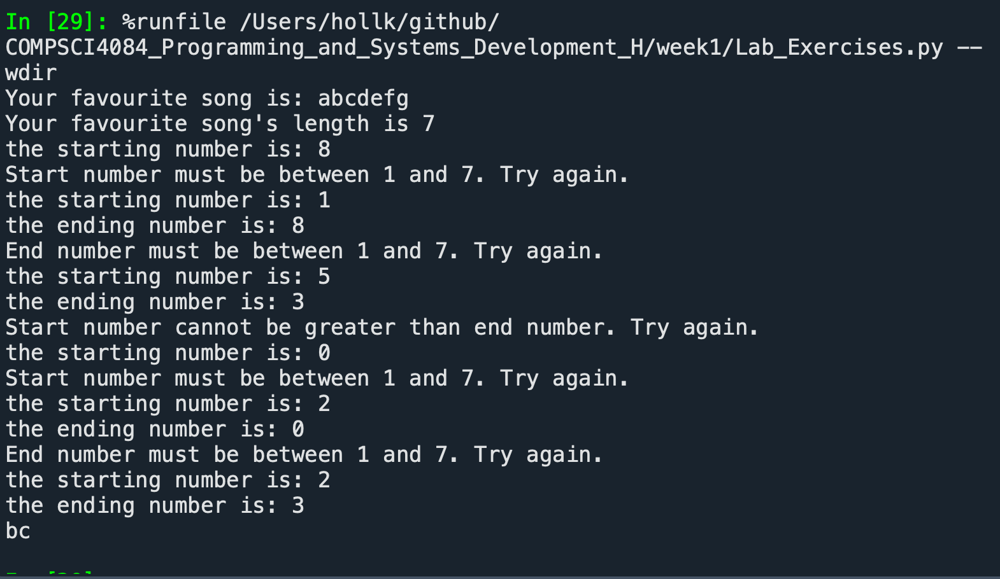

## Exercise: Upper or Lower case name

Write a programme that asks the user to enter their first name. If the length of the first name is under five characters, the programme should ask them to enter their surname and join them together (without a space) and display the name in upper case. If the length of their first name is five or more characters, display their first name in lower case.

```python
while True:
    first_name = input("Enter your first name: ").strip()
    if 0 == len(first_name):
        print("First name cannot be empty. Try again.")
    else:
        break

if len(first_name) < 5:
        while True:
        surname = input("Enter your surname: ").strip()
        if 0 == len(surname):
            print("Surname cannot be empty. Try again.")
        else:
            break

    full_name = (first_name + surname).upper()
    print("Your name is:", full_name)
else:
    print("Your name is:", first_name.lower())
```

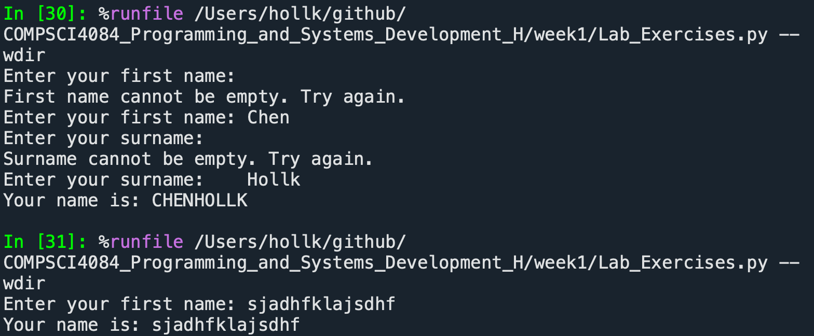

## Exercise: Pig Latin

Pig Latin takes the first consonant of a word, moves it to the end of the word and adds on an “ay”. If a word begins with a vowel you just add “way” to the end. For example, pig becomes igpay banana becomes ananabay, and aardvark becomes aarvarkway. Create a programme that will ask the user to enter a word and change it into Pig Latin. Make sure the new word is displayed in lower case.

```python
vowels = "aeiou"

while True:
    word = input("Enter a word: ").lower().strip()
    
    if not word.isalpha():
        print("Invalid input. Please enter letters only (no numbers, no empty input). Try again.")
        continue

    if word[0] in vowels:
        pig_latin = word + "way"
    else:
        pig_latin = word[1:] + word[0] + "ay"

    print("Pig Latin:", pig_latin)
    break
```

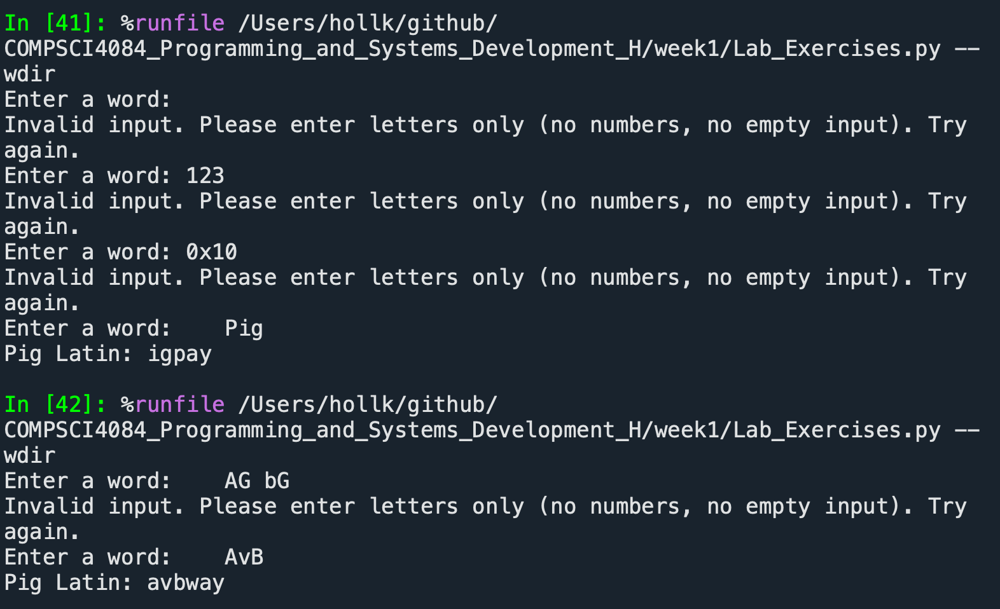


## Exercise: Umbrella or no umbrella
Write a programme that asks the user if it is raining and convert their answer to lower case so that it doesn’t matter what case they type in. If they answer “yes”, ask if it is windy. If they answer “yes” to the second question, display the answer “It’s too windy for an umbrella”, otherwise display the message “Take an umbrella”. If they did not answer “yes” to the first question, display the answer “Enjoy your day”.

```python
while True:
    raining = input("Is it raining? ").strip().lower()
    if 0 == len(raining):
        print("You must enter something.")
    else:
        break

if raining == "yes":
    while True:
        windy = input("Is it windy? ").strip().lower()
        if 0 == len(windy):
            print("You must enter something.")
        else:
            break

    if windy == "yes":
        print("It's too windy for an umbrella")
    else:
        print("Take an umbrella")
else:
    print("Enjoy your day")
```

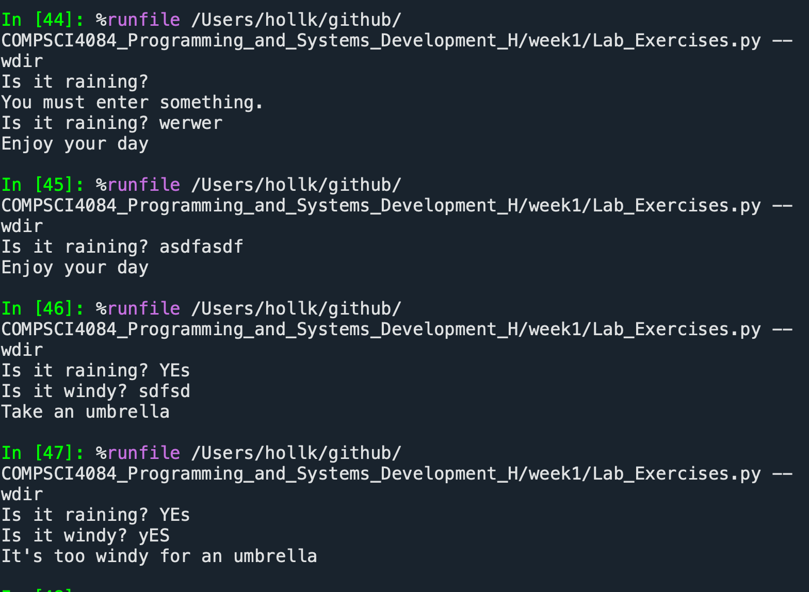


## Exercise: Your age

Write a programme that asks the user’s age. If they are 18 or over, display the message “you can vote”. If they are 17, display the message “You can learn how to drive”. If they are 16, display the message “you can buy a lottery ticket” and if they are under 16, display the message “You can go Trick-or-Treating”.

```python
while True:
    age_humen = input("Please enter your age: ")
    try:
        age = int(age_humen)
        if age <= 0:
            print("You need to enter a correct age, please re-enter")
            continue
        else:
            break
    except ValueError:
            print("You should enter a number, like 1,2,3, Thanks")

if age >=18:
    print("You can vote")

elif 17 == age:
    print("You can learn how to drive")
    
elif 16 == age:
    print("You can buy a lottery ticket")

elif age < 16:
    print("You can go Trick-or-Treating")
```

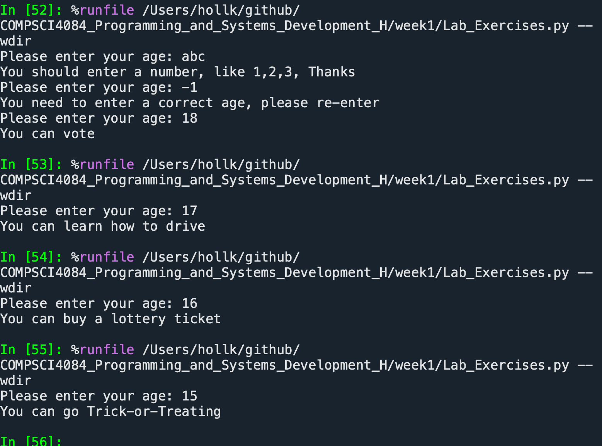

## Exercise: Even or Odd
Write a programme that reads an integer from the user. Then your programme should display a message indicating whether the integer is even or odd.

```python
while True:
    try:
        number_human = input("Please enter a number: ")
        num = int(number_human)
        break
    
    except ValueError:
        print("You should enter a integer number, like 1,2,3,4. Thanks!")
        continue

even_odd = num % 2
if 0 == even_odd:
    print("The number you entered is even !")
else:
    print("The number you entered is odd !")
```

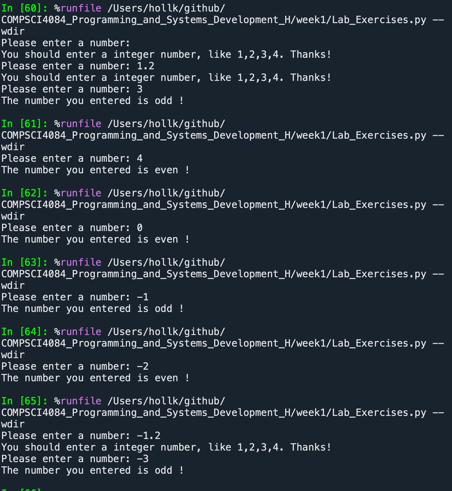

## Exercise: Vowel or Consonant
In the exercise, you will create a programme that reads a letter of the alphabet from the user. If the user enters a, e, i, o or u then your programme should display a message `indicating `that the entered letter is a vowel. If a user enters y then your programme should display a message indicating that sometimes y is a vowel, and sometimes y is a consonant. Otherwise, your programme should display a message indicating that the letter is a consonant.

```python
vowels = "aeiou"

while True:
    letter = input("Enter a word: ").lower().strip()
    if not letter.isalpha():
        print("Invalid input. Please enter letters only (no numbers, no empty input). Try again.")
        continue
    
    if len(letter) > 1:
        print("You should enter only one letter, thanks")
        continue
    
    else:
        break

if letter in vowels:
    print("The letter you entered is vowel.")
    
elif letter == "y":
    print("The letter you entered sometimes is a vowel, and sometimes is a consonant.")
    
else:
    print("The letter you entered is a consonant.")
```

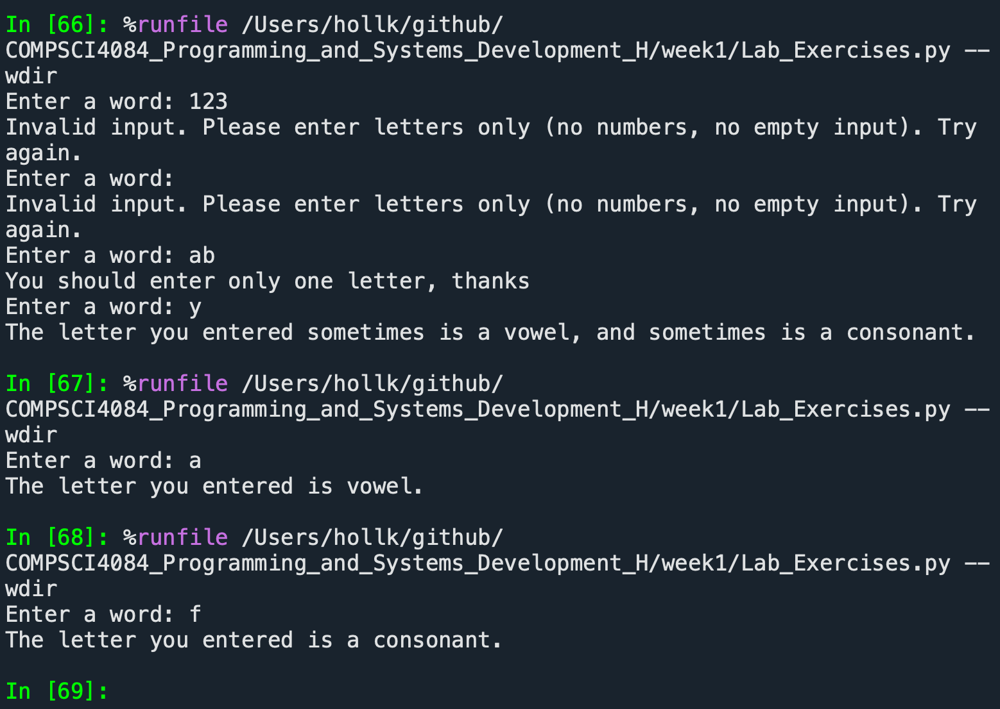


## Exercise: Name the shape
Write a programme that determines the name of a shape from its number of sides. Read the number of sides from the user and then report the appropriate name as part of a meaningful message. Your programme should support shapes with anywhere from 3 to up to (and including) 10 sides. If a number of sides outside of this range is entered then your programme should display an appropriate error message.

```python
approriate_lab = ["Triangle","Quadrilateral","Pentagonal","Hexagon",
                  "Heptagonal","Octagonal","Nonagon","Decagonal"]

while True:
    try:
        num_human = input("Please enter one number only, form 3 to 10: ")
        num = int(num_human)
        
        if num >= 3 and num <= 10:
            break
        else:
            print("The number needs to be between 3 and 10. The number you entered exceeds this range.")
            continue
        
    except ValueError:
        print("Please enter number only, form 3 to 10, no strings, no empty input")

print(f"The number you entered is {num}, and this is {approriate_lab[num-3]}")
```

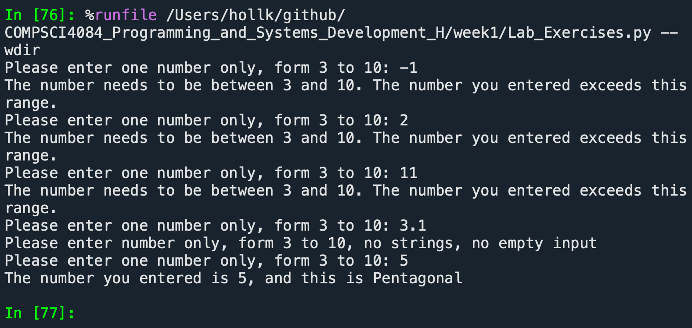


## Exercise: Classifying Triangles
A triangle can be classified based on the lengths of its sides as equilateral, isosceles or scalene. All three sides of an equilateral triangle have the same length. And isosceles triangle has two sides that are all the same length and a third side that is a different length. If all of the sides have different lengths then the triangle is scalene.

Write a programme that reads the lengths of the three sides of a triangle from the user. Then display a message that states the triangle’s type.

```python
print("Please enter the lengths of the three sides of a triangle:")

while True:
    
    try:
        fir_num = input("The length of the first side:")
        sec_num = input("The length of the second side:")
        thi_num = input("The length of the third side:")
        
        first_side = float(fir_num)
        second_side = float(sec_num)
        third_side = float(thi_num)
        
        if first_side+second_side<=third_side or second_side+third_side<=first_side or first_side+third_side<=second_side:
            print("The lengths of the three sides you provided cannot form a triangle. Please re-enter!")
            continue
        else:
            break
    
    except ValueError:
        print("Please enter the number, no strings, no empty input, thanks!")

if first_side == second_side == third_side:
    print("This is a equilateral triangle")

elif first_side == second_side or first_side == third_side or second_side == third_side:
    print("This is isosceles triangle")
    
else:
    print("This is scalene triangle")
```

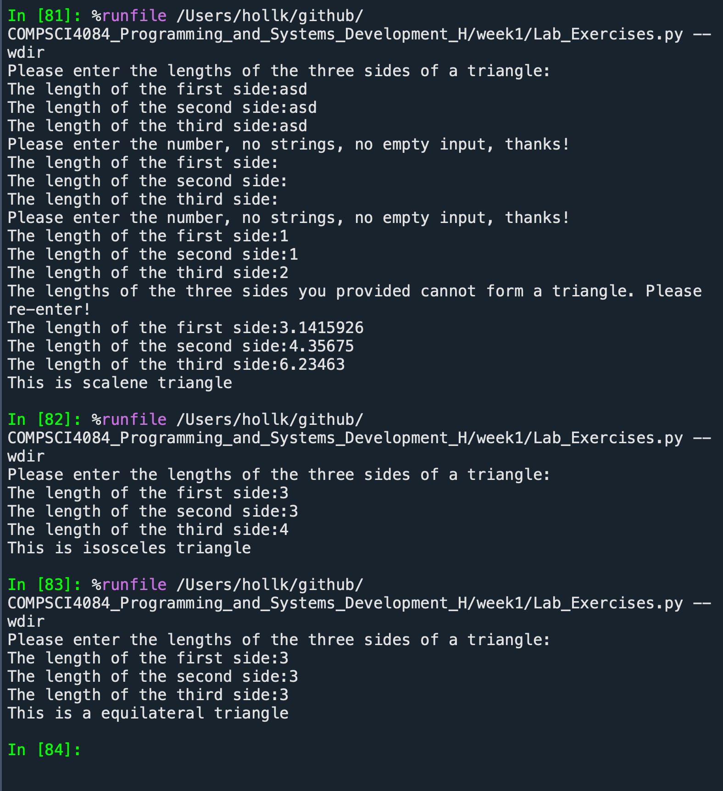


## Exercise: Find the area
Write a programme that displays the following message:
1. Square

2. Triangle
    Enter a number:

If a user enters 1, then it should ask them for the length of one of its sides and display the area. 
If they select 2, it should ask for the base and height of the triangle and displays the area. If they type in anything else, it should give them a suitable error.

```python
def area_square(side_length):
    return side_length ** 2

def area_triangle(height, base):
    return height * base / 2

def get_positive_number(prompt):
    while True:
        user_input = input(prompt)
        try:
            num = float(user_input)
            if num > 0:
                return num
            else:
                print("Please enter a positive number")
        except ValueError:
            print("Your input does not conform to the rules. Please re-enter.")

print("1) Square")
print("2) Triangle")

while True:
    try:
        shape_choice_input = input("\tEnter a number: ")
        shape_choice = int(shape_choice_input)
        if shape_choice in (1, 2):
            break
        else:
            print("Please enter 1 or 2.")
    except ValueError:
        print("Your input does not conform to the rules. Please re-enter.")

match shape_choice:
    case 1:
        side_length = get_positive_number("Please enter the length of the side: ")
        print(f"The square's area is {area_square(side_length)}")

    case 2:
        triangle_height = get_positive_number("Please enter the height: ")
        triangle_base = get_positive_number("Please enter the base: ")
        print(f"The triangle's area is {area_triangle(triangle_height, triangle_base)}")
```

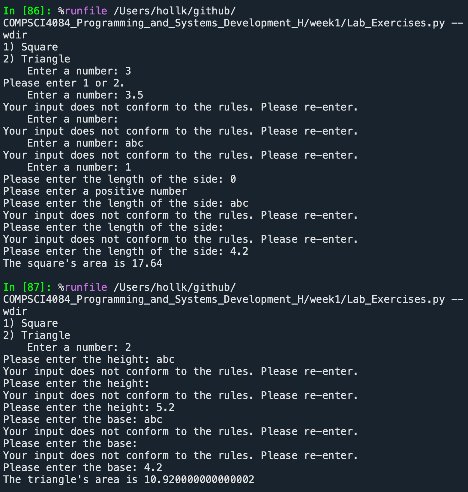


