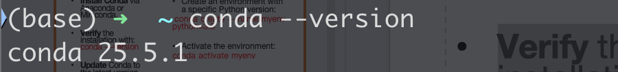
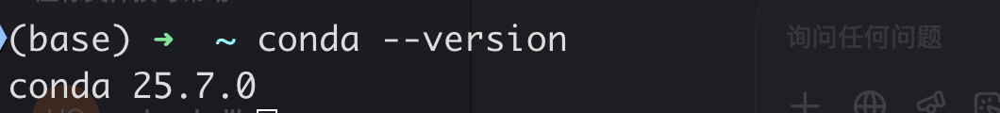

<h1 align="center">
Using Conda and Google Colab
</h1>

[TOC]

# 1. Setting Up Conda and Creating a New Environment

## 1.1 Setting Up Conda

### 1.1.1 Install Conda

In Moodle, there is a download link for Anaconda3. Just download the installer for your operating system, and once installed, Conda will be available.


### 1.1.2 Verify the installation

```shell
conda --version
```



The version of Conda downloaded from Anaconda 3 by default is Conda 25.5.1.

### 1.1.3 Update Conda tthe latest version

```shell
conda update conda
```


Here it requires running `conda update -n base -c defaults conda`, but after running it, the upgrade still fails. This may be because the defaults channel is not updated in time, so you can use `conda-forge` to update instead:

```shell
conda install -n base -c conda-forge conda
```


Rerun the following command:

```shell
conda update -n base -c defaults conda
```


Check it, the version has been upgraded from 25.5.1 to 25.7.0.



### 1.1.4 Create an environment with a specific Python version

I have to complain a bit: the course PPT here asks to create a Python 4.14 environment, which is an obvious trap. The latest preview version available is only 3.14.

```shell
conda create --name myenv python=3.8
```


### 1.1.5 Activate the environment

```shell
conda activate myenv
```


If the previous content changes, it means the startup was successful.

### 1.1.6 Deactivate the environment

```shell
conda deactivate
```


If the previous content changes, it means the deactivation was successful.

## 1.2 Managing Environments

### 1.2.1 Listing all environments

```shell
conda env list
```


This is the myenv we just created.

### 1.2.2 Removing an environment

```shell
conda remove --name myenv --all
```


Check again to confirm whether it has been successfully deleted.


### 1.2.3 Cloning an environment

It should be noted here that if you follow the order in the PPT, you need to recreate myenv. If myenv does not exist, newenv cannot find a source to clone from.

```shell
conda create --name myenv python=3.8
conda create --name newenv --clone myenv
```


Check whether it has been created successfully.


## 1.3 Installing and Managing Packages

### 1.3.1 Installing a package

```shell
conda install numpy
```


### 1.3.2 Updating a package

```shell
conda update numpy
```


### 1.3.3 Removing a package

```shell
conda remove numpy
```


## 1.4 Exporting and Sharing Environments

### 1.4.1 Exporting an environment ta YAML file

It should be noted here that if the -n parameter is not used to specify the environment, the currently activated environment will be exported by default.


If the -n parameter is added, it is not necessary to activate the environment.


### 1.4.2 Creating an environment from a YAML file

Previously, the yml file of myenv was exported. Now you can delete the myenv environment and recreate it using the yml file.


Check the list.


The myenv environment no longer exists.

```shell
conda env create -f environment.yml
```


Check the list again.


