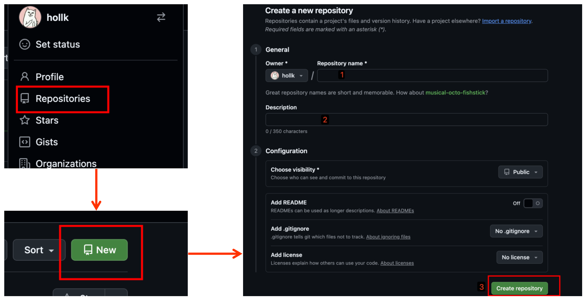
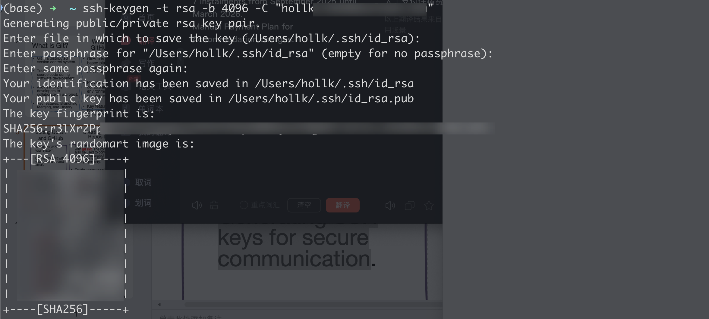
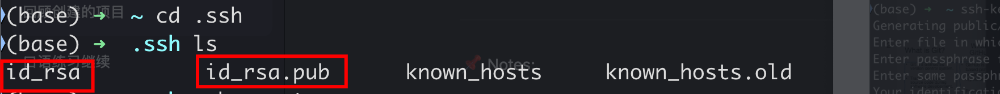
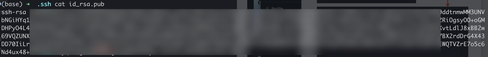
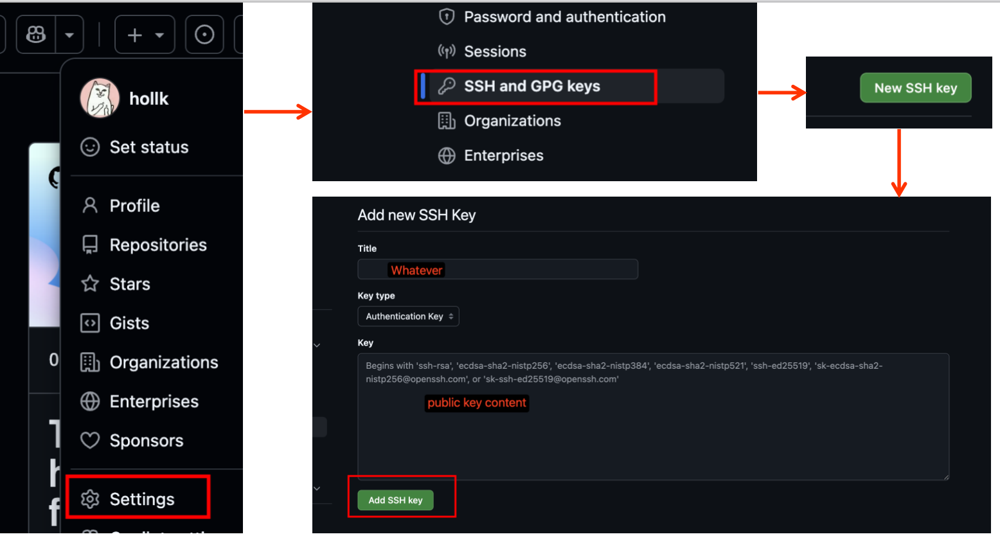
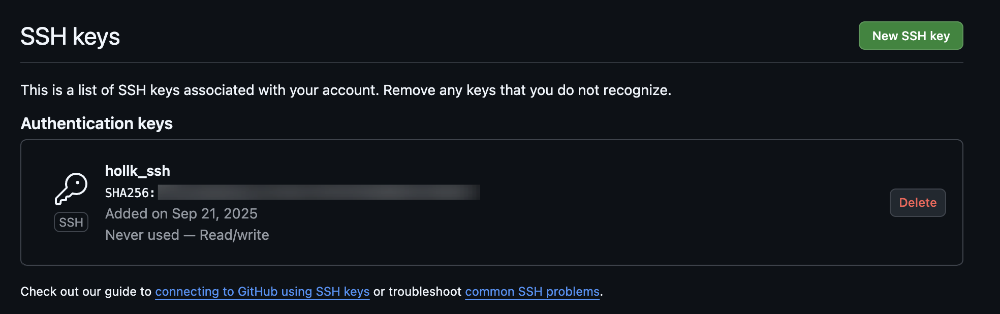
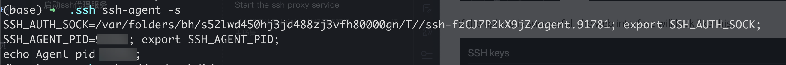
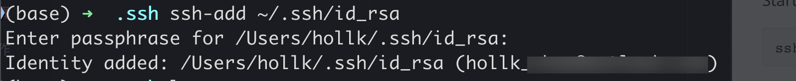
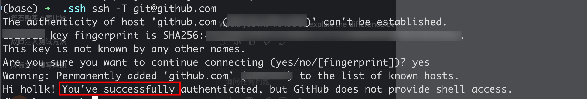

# 1. Using Git and gitHb
### 1.1 Initialise a new repository locally

Create a  new folder and initialize this folder with git

```shell
mkdir ~/github
cd ~/github
git init
```


After initalization, a hidden .git folder will be created in the current directory


### 1.2 Create a new repository on GitHub

Just click according to the steps



* Choose visibility

Public: anyone can see your repository

Private: only you and collaborators you invite can see it

* Add REDME

A README.md file explains your project

* Add .gitignore 

A .gitignore file tells Git which files not to track

* Add license

A license explains how others can use your code 

### 1.3 Connect the local repository to remote GitHub

```shell
git remote add origin https://github.com/hollk/your_repository_name.git
```

### 1.4 Generating SSH keys for secure communication

* Step 1: Generate an SSH private key and public key on my local

```shell
ssh-keygen -t rsa -b 4096 -C "your_enmail"
```



The private key and public key are saved in ~/.ssh/



* Step 2: upload public key content

```shell
cat ./id_rsa.pub
```



Copy the content of public key and go to github website.

The click sequence is: Avatar - Setting - SSH and GPC keys - New SSH key - Paste the public key information into the input box.



If the upload is successful, the web interface will look like this:



* Step 3: Check whether the SSH connection is successful.

Start the SSH proxy service

```ssh
ssh-agent -s
```



Add the private key to the SSH proxy

```shell
ssh-add ~/.ssh/id_rsa
```



Tests whether SSH key is correctly set up with GitHub

```shell
ssh -T  git@github
```



### 1.5 Push the initial commit to github


