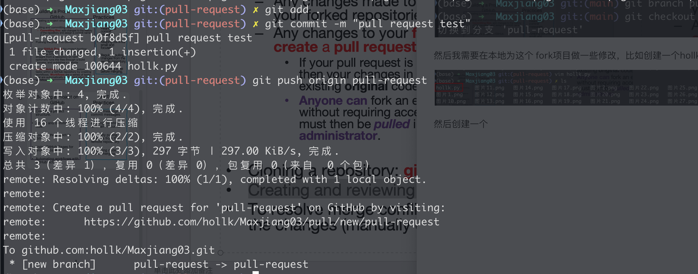

<h1 align="center">
Using Git and gitHub
</h1>

[TOC]
## 1. Setting up and Creating a New Repository

### 1.1 Initialise a new repository locally

Create a  new folder and initialize this folder with git

```shell
mkdir ~/github
cd ~/github
git init
```


After initalization, a hidden .git folder will be created in the current directory


### 1.2 Create a new repository on GitHub

Just click according to the steps


* Choose visibility

Public: anyone can see your repository

Private: only you and collaborators you invite can see it

* Add REDME

A README.md file explains your project

* Add .gitignore 

A .gitignore file tells Git which files not to track

* Add license

A license explains how others can use your code 

### 1.3 Connect the local repository to remote GitHub

```shell
git remote add origin https://github.com/hollk/your_repository_name.git
```

### 1.4 Generating SSH keys for secure communication

* Step 1: Generate an SSH private key and public key on my local

```shell
ssh-keygen -t rsa -b 4096 -C "your_enmail"
```


The private key and public key are saved in ~/.ssh/


* Step 2: upload public key content

```shell
cat ./id_rsa.pub
```


Copy the content of public key and go to github website.

The click sequence is: Avatar - Setting - SSH and GPC keys - New SSH key - Paste the public key information into the input box.


If the upload is successful, the web interface will look like this:


* Step 3: Check whether the SSH connection is successful.

Start the SSH proxy service

```ssh
ssh-agent -s
```


Add the private key to the SSH proxy

```shell
ssh-add ~/.ssh/id_rsa
```


Tests whether SSH key is correctly set up with GitHub

```shell
ssh -T  git@github
```


### 1.5 Push the initial commit to github

I didn't push the initial commit, I pushed this blog

* Step 1: I placed the newly created learning blog in the root directory of git


* Step 2: Use SSH to remotely connect to the repository i created on the github website

```shell
git remote add origin git@github.com:hollk/University-of-Glasgow-learning.git
```

And check my execution results:

```shell
git remote -v
```


>I made some mistakes here:
>
>1. At first, the address of the remote Repository I set was misspelled (lerning instead of learning), resulting in Repository not found.
>2. At the very beginning, an HTTPS address was used, so when pushing, it prompted that the GitHub username and password needed to be entered. However, GitHub has disabled password authentication. PAT (Personal Access Token) or SSH key is required. It was only after changing the SSH address that the problem was solved.

* Step 3:Ready for push

Use the git add command to tell Git which file i want to include in the next commit

Use the git commit command to save the staged files into the Git history

```shell
git brach main
git add .
git commit -m "Create 4084 blog"
```


* Step 4: Push to the remote

Rename the branch I am currently in(such as master) to main

Force my local main branch to be pushed to the main branch of the remote origin repository


> I made a mistake here:
>
> 1. The default branch of your local repository is master, but the default branch for creating a new repository on GitHub is main. When you run git push origin master:main, GitHub prompts a non-fast-forward error because the remote main branch already has content (usually an automatically generated README.md or.gitignore). However, your local master submission lags behind the remote one.

* Step 5: Check my github website


## 2. Basic Git Commands

* git status

Check the status of your repository


* git add and git commit

Stage changes for commit  (adds a change in the working directory to the staging area) 

Save changes to the repository.


* git push

Push changes to a remote repository.


* git pull

Fetch and merge changes from a remote repository.

I haven't taken screenshots here because currently my local data is more updated than the remote data. There will be some problems in data integration after using git pull.

git pull = git fetch + git merge


## 3. Working with Branches

At the beginning, I didn’t really understand the purpose of branches.

My understanding is this: other members of the project may need to modify or upgrade the stable version of the code, but they don’t want to affect the already stable and running version in the main branch.

So, they create a new branch, which is based on a snapshot of the stable version, and then make modifications or upgrades on that branch.

After finishing the modifications or testing locally, they merge the branch back into the main branch.

In this way, the next version can be iterated without affecting the existing stable version.

### 3.1 Branch experiment

I am not sure if my understanding is correct, so I conducted a set of experiments:

* 1. Create a file named a.py in the root directory of git, with the following content:

```python
print("version v1.1")
```


* 2. Use the main branch to add and push to the remote.


* 3. Check whether the remote has been uploaded successfully:


* 4. Create a new branch named hollk and switch to the hollk branch.


* 5. In the hollk branch, modify the content of the a.py file as follows:

```python
print("version v1.2")
```

* 6. Push to the remote with the hollk branch, which will actually create a new request for the hollk branch.


* 7. Check the push status of the hollk branch.


It is indeed the modified file content of the hollk branch. At this point, the a.py file under the local path has the same content:


* 8. Switch back to the main branch and check the a.py file under the local path.


Here you can see that the content of the a.py file in the main branch is not actually affected by the modifications in the hollk branch.

* 9. After merging the content from hollk into the main branch, push again to the remote through the main branch.


Check the remote, and it has already been updated with the new content.


* 10. Finally, delete the hollk branch both locally and on the remote.


## 4. Collaborating with GitHub

### 4.1 Foking a repository

Select a lucky man as the test subject.


After creation, the fork of this repository will appear in your own repository.


### 4.2 cloning a repository

You can use HTTPS or SSH, but if you want to make a Pull Request, it is better to clone the repository using SSH to avoid issues with account and password when pushing.

* HTTPS: (friend's git repository)

```shell
https://github.com/hollk/Maxjiang03.git
```

* SSH: (friend's git repository)

```shell
git@github.com:hollk/Maxjiang03.git
```


### 4.3 Creating and reviewing Pull Requests.

To be on the safe side, I need to create a pull-request branch and switch to it.


Then I need to make some modifications to this fork project locally, such as creating a file named hollk.py:


As in the previous steps, I need to push the entire project to the remote:



Check the website:


Then click the green Compare & pull request button on the right.


At the bottom, you can see the result of the content comparison:


Since I will need my friend’s cooperation later, I didn’t bother him this time, so I’ll leave it here for now and add more later.
